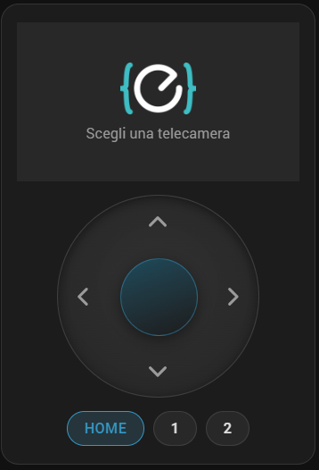

<div align="center">

# Eufy - Camera

**One Lovelace card for a pan-tilt eufy camera: the live picture, a d-pad that really moves it, and
your saved positions a click away.**

[](https://eufy-camera-card.github.io/)
[](https://hacs.xyz/docs/faq/custom_repositories/)
[](https://github.com/Filpin011/eufy-camera-card/releases)
[](LICENSE)

[](https://my.home-assistant.io/redirect/hacs_repository/?owner=Filpin011&repository=eufy-camera-card)



</div>

---

## What you get

|  |  |
| --- | --- |
| **A d-pad that moves the camera** | Drag the joystick, or press a direction and hold — it keeps stepping. Three shapes to choose from: joystick, flat ring, or four keys in a cross. |
| **Presets as buttons** | One chip per position your camera has actually stored, read from the camera itself. Click, and it goes there. |
| **The live view, on your terms** | It shows the last event's picture and opens the stream only when you press play — then closes itself. On a battery camera that is the difference between days and hours. |
| **Nothing to look up** | Pick the camera from a list. The controls behind it are found for you, and keep working if you rename an entity or change language. |

## Before you start

You need:

- the **[ha-eufy-sdk](https://github.com/mega-yfue/ha-eufy-sdk)** integration, with a camera it
  reports as pan-tilt
- **[webrtc-camera](https://github.com/AlexxIT/WebRTC)** for the live view — without it the card
  shows the still picture and skips the player, since nothing else here plays RTSP

## Install

**1 · Add the repository to HACS** — one click:

[](https://my.home-assistant.io/redirect/hacs_repository/?owner=Filpin011&repository=eufy-camera-card)

Or by hand: **HACS → ⋮ (top right) → Custom repositories**, add
`https://github.com/Filpin011/eufy-camera-card` with type **Dashboard** *(called Lovelace on older
HACS)*.

**2 · Download it** — search HACS for **Eufy - Camera**.

**3 · Reload the browser** with <kbd>Ctrl</kbd>+<kbd>Shift</kbd>+<kbd>R</kbd>.

The card is now in the picker, listed as *Eufy - Camera*.

> Releases are currently marked **pre-release**. If HACS shows nothing to download, open the card in
> HACS and turn on *Show beta versions* in its ⋮ menu.

## Use it

Add the card, pick your camera, done — the visual editor covers everything:

```yaml
type: custom:eufy-camera-card
device: Front door camera
camera: auto
```

<details>
<summary><b>All the options</b></summary>

<br>

| option | default | what it does |
| --- | --- | --- |
| `device` | — | the camera; everything else is found from it. A device name or its id |
| `camera` | unset | `auto` builds the player from the camera. Or name a `camera.` entity, or nest a whole card config of your own |
| `go2rtc` | from the camera | only if you republished go2rtc on a different port |
| `live` | `on_demand` | `on_demand`, `follow` (mains-powered cameras) or `never` |
| `live_timeout` | `120` | seconds before the live view closes itself |
| `fallback_delay` | `8` | seconds to wait before dropping back to the still picture |
| `dpad` · `chips` · `picker` | `true` | show or hide each part of the card |
| `variant` | `joystick` | `joystick`, `ring` or `cross` |
| `size` | `180` | d-pad diameter, in pixels |
| `interval` | `350` | milliseconds between steps while a direction is held |
| `deadzone` | `0.28` | how far the joystick travels before it sends anything |
| `theme` | `auto` | follows Home Assistant, or force `dark` / `light` |

`up`, `down`, `left`, `right`, `select` and `goto` can each name an entity explicitly, which overrides
whatever `device` found — handy for a camera the lookup cannot see.

</details>

<details>
<summary><b>Why the live view is not always on</b></summary>

<br>

A player does not merely watch a stream, it **holds one open**. On a battery camera that keeps the
radio awake and flattens it in hours, and the bridge's own idle-off cannot step in while a client is
still pulling.

So the card shows the last-event still, which costs nothing, and treats the live view as something
you open on purpose. It closes again after `live_timeout`, and when you navigate away — a forgotten
tab does not keep your camera awake.

Mains-powered camera? `live: follow` mirrors the streaming sensor and behaves the way you would
expect.

</details>

<details>
<summary><b>Add your language</b></summary>

<br>

English and Italian are included. To add another, drop `<lang>.json` into `dist/` with a `card`
section — the card fetches it at runtime, so there is no JavaScript to edit:

```json
{
  "card": {
    "pick_camera": "Pick a camera",
    "watch": "Watch now",
    "live": "Live",
    "goto": "Go to preset"
  }
}
```

A regional tag falls back to its base — `pt-BR` tries `pt` — and anything you leave out falls back to
English. Pull requests with new languages are very welcome.

</details>

<details>
<summary><b>Releasing (maintainers)</b></summary>

<br>

Work lands on `dev`; `main` is the released card, and the only branch HACS installs from.

To publish one: bump `VERSION` in `dist/eufy-camera-card.js` on `dev`, merge `dev` into `main`,
then **Actions → Release → Run workflow** from `main` with that same version. It runs the tests,
refuses if the card and the version you typed disagree, and tags the release. Nothing publishes on a
push, and the workflow never writes to the repository.

Everything HACS installs sits flat in `dist/` — the card, its translations, its images. No
subdirectories and no attached archive: HACS validates a plugin by looking for a `.js` named after the
repository, and rejects a zip release even though its installer would accept one
([hacs/integration#4928](https://github.com/hacs/integration/issues/4928)).

</details>

## Credits

Built on the [ha-eufy-sdk](https://github.com/mega-yfue/ha-eufy-sdk) integration and its
[bridge](https://github.com/mega-yfue/ha-eufy-sdk-bridge) by
[@mega-yfue](https://github.com/mega-yfue), and on
[webrtc-camera](https://github.com/AlexxIT/WebRTC) by [@AlexxIT](https://github.com/AlexxIT).

Released under the [MIT licence](LICENSE).
